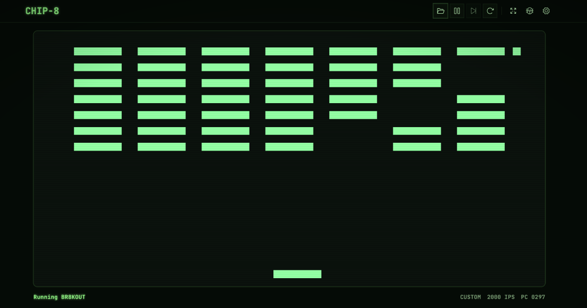

# CHIP-8 Emulator



A CHIP-8 emulator written in C# / .NET 10, with three front-ends sharing a common core.

Live demo: [chip8.builtbyzee.com](https://chip8.builtbyzee.com/)

## About this project

This repo is a **playground**. I'm using CHIP-8, the simplest practical ISA I know, as a low-stakes sandbox to experiment with different ways of structuring an emulator: splitting CPU from machine, dependency wiring, mediator patterns, the tradeoffs between staying close to how real hardware worked and using modern software-design conventions. Expect the architecture to keep shifting as I try ideas and revert the ones that don't pay off. The goal is to build up intuition here before tackling more complex systems (NES, Game Boy, etc.) where the same design choices carry much more weight.

If you're reading the code hoping for a textbook "correct" layout, this isn't it. If you're curious about the tradeoffs involved in designing an emulator's internal seams, you're in the right place.

## Projects

- **`Chip8Emulator.Core`** — the interpreter (memory, registers, fetch/decode/execute, 60Hz timing) plus a shared `StopwatchClock`.
- **`Chip8Emulator.Core.Tests`** — xUnit tests for the core.
- **`Chip8Emulator.Cli`** — terminal front-end, renders to the console with ANSI half-block characters.
- **`Chip8Emulator.Web`** — browser front-end, runs in WebAssembly and draws to a `<canvas>` through a Svelte/Vite UI.
- **`Chip8Emulator.Desktop`** — desktop front-end (WIP).

## Running

### CLI

```sh
dotnet run --project Chip8Emulator.Cli -- path/to/rom.ch8
```

### Browser (Web)

Requires the `wasm-tools` workload:

```sh
dotnet workload install wasm-tools
dotnet run --project Chip8Emulator.Web
```

## ROMs

The Web build bundles a curated set of ROMs in
`Chip8Emulator.Web/web/public/roms/`. Most come from the CC0-licensed
[Chip8 Community Archive](https://github.com/JohnEarnest/chip8Archive); the
two classics (Tetris by Fran Dachille, Space Invaders by David Winter) are
freeware sourced via [kripod/chip8-roms](https://github.com/kripod/chip8-roms).
See `Chip8Emulator.Web/web/public/roms/SOURCES.md` for per-ROM provenance.

For more ROMs to load via the upload button, the
[kripod/chip8-roms](https://github.com/kripod/chip8-roms/tree/master)
collection and David Winter's [pong-story.com archive](http://pong-story.com/chip8/)
are both good starting points.

## Tests

```sh
dotnet test
```

## Resources

- [Cowgod's Chip-8 Technical Reference](http://devernay.free.fr/hacks/chip8/C8TECH10.HTM)
- [Tobias V. Langhoff — Guide to making a CHIP-8 emulator](https://tobiasvl.github.io/blog/write-a-chip-8-emulator/#fetchdecodeexecute-loop)
